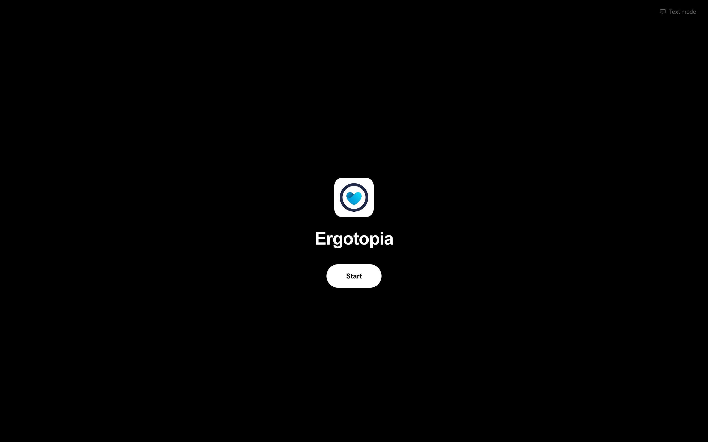
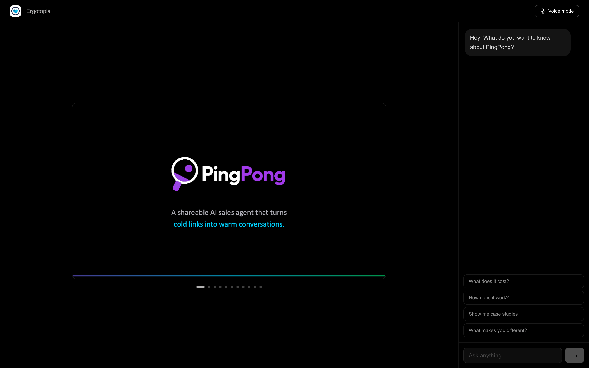
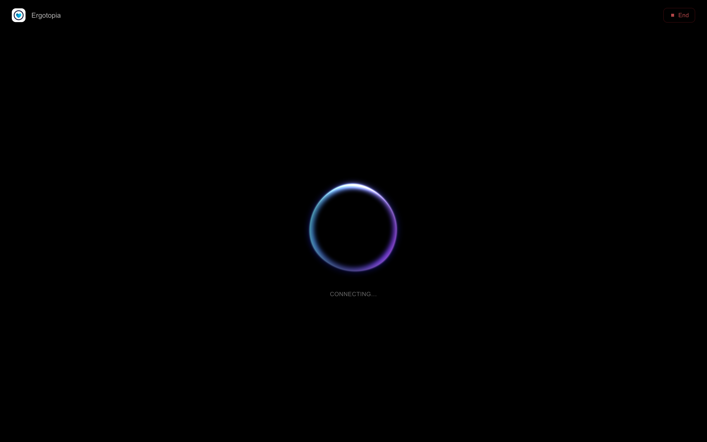
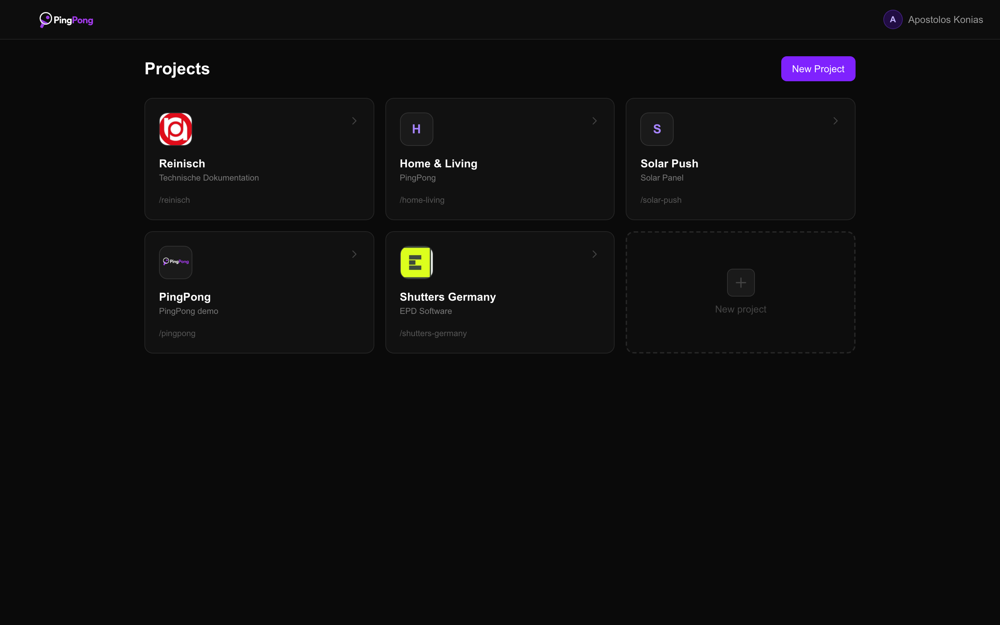
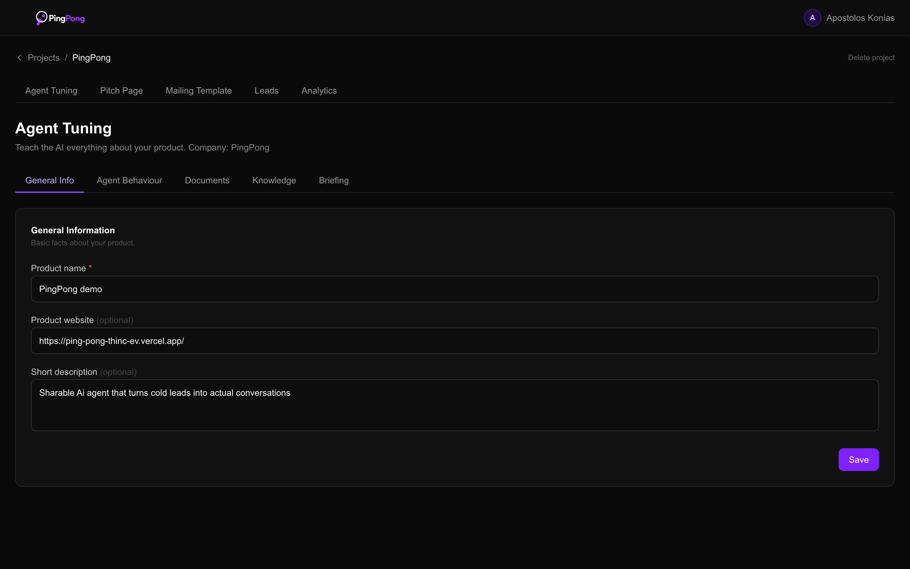
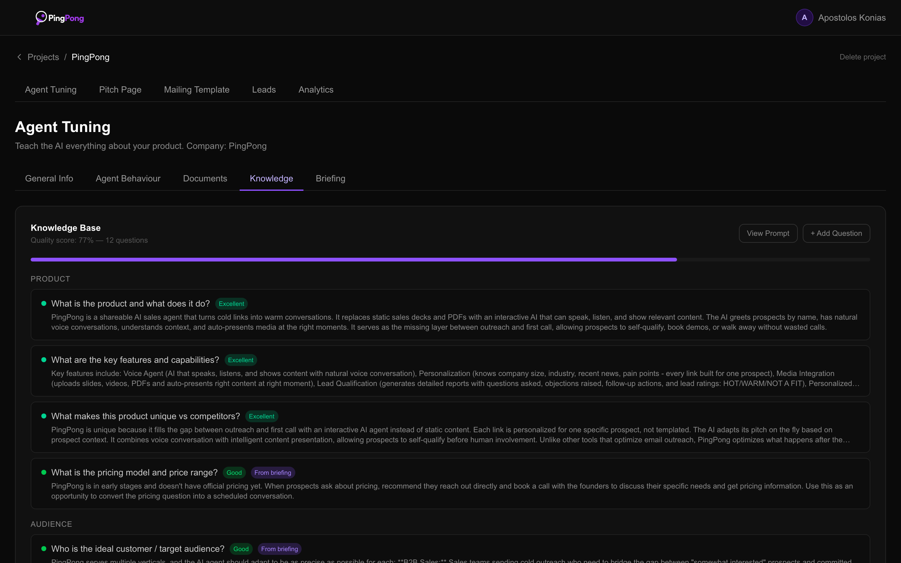

# PingPong

> Interactive AI sales pages that replace static pitch decks — every prospect gets a personal link where an AI agent presents the product, answers questions, navigates slides, and qualifies the lead in text or voice.

**🏆 1st place — thinc! × Cursor Hackathon (March 2026).** Built in 30 hours by a two-person team against 20+ competing teams.

<p align="center">
  
</p>

---

## What it is

Sending a PDF to a prospect is a dead end: you can't see engagement, you can't answer questions, and the deck sits unopened. PingPong turns that static artifact into an interactive link (`/p/[slug]`) where a personalised Claude agent — primed with your product knowledge and the prospect's public context — runs the conversation end-to-end.

The seller never writes the system prompt. They upload docs, answer a structured briefing, or just hit a voice interview mode and talk — Claude extracts a structured knowledge base, scores answer quality, and regenerates the agent's system prompt automatically.

## How it works

```
Prospect opens /p/[slug]
    │
    ├── Text mode  → Claude streaming + show_slide tool call
    │                 (/api/chat, SSE, clause-level chunking)
    │
    └── Voice mode → ElevenLabs Conversational AI over WebSocket
                      + WebGL orb reacts to mic + agent speech
                      (/api/elevenlabs/signed-url with runtime overrides)

Seller dashboard
    │
    ├── Documents  → PDF / PPTX / DOCX upload
    │                 ├── Text-layer PDFs → unpdf extraction
    │                 └── Image-heavy decks → Claude Vision (base64 PDF)
    │
    ├── Knowledge  → 12 standard + custom questions, quality-scored
    │                 (empty / basic / good / excellent)
    │
    ├── Briefing   → Interview mode with propose_knowledge_update tool
    │                 + voice mode using the same WebGL orb
    │
    └── Leads      → CSV import, per-prospect pitch links,
                      auto-research via website crawl + Claude profiling,
                      post-call qualification reports (HOT / WARM / NOT_A_FIT)
```

## Screenshots

**Prospect side — one link, three states:**

| Per-prospect Start screen | Text mode | Voice mode |
|---|---|---|
|  |  |  |

The Start screen carries the prospect's branding (pulled from their lead record). Text mode shows a slide deck with a chat overlay and suggested questions. Voice mode swaps the chat for a WebGL orb that reacts to mic amplitude and agent speech.

**Seller side — projects, agent tuning, knowledge:**

| Projects | Agent Tuning | Knowledge |
|---|---|---|
|  |  |  |

Each project has five sub-tabs (General Info, Agent Behaviour, Documents, Knowledge, Briefing). The Knowledge view shows quality-scored answers to 12 standard questions plus custom ones — this is what Claude uses to auto-generate the system prompt.

## Tech stack

| Layer | Technology |
|---|---|
| Framework | Next.js 16 (App Router) · React 19 · TypeScript |
| Styling | Tailwind CSS v4 |
| Database | Supabase (PostgreSQL + Storage + Row-Level Security) |
| LLM | Anthropic Claude — streaming, tool use, vision |
| Voice | ElevenLabs Conversational AI (STT + LLM + TTS, Flash v2.5) |
| PDF | `unpdf` for text, `pdfjs-dist` for client-side page rendering |
| WebGL | OGL shader-based animated orb |
| Email | Gmail API v1 via OAuth 2.0 |
| Deployment | Vercel |

## Key implementation details

Each of the claims below maps to code in this repo:

**Claude tool use — agent navigates the deck mid-conversation**
The agent calls a `show_slide` tool while answering questions, and the client-side pitch page swaps the slide in real time. Agentic loop with clause-level SSE chunking for low-latency streaming.
→ [`src/app/api/chat/`](src/app/api/chat/), [`src/app/p/[slug]/`](src/app/p/)

**Claude Vision — image-heavy pitch decks as input**
PDFs are tried through `unpdf` first. If the text layer is empty (typical for design-heavy decks), the full PDF is sent to Claude as base64 vision input for knowledge extraction and per-slide title/description generation.
→ [`src/app/api/project/process-docs/`](src/app/api/project/process-docs/), [`src/app/api/project/slides/generate-metadata/`](src/app/api/project/slides/)

**ElevenLabs voice pipeline — single WebSocket, per-session overrides**
One ElevenLabs agent, but the system prompt and first message are overridden per session from the product's knowledge base and the prospect's context. The prospect-facing pitch page and the seller's briefing interview share the same voice component.
→ [`src/app/api/elevenlabs/signed-url/`](src/app/api/elevenlabs/), [`src/app/api/project/briefing-voice/`](src/app/api/project/briefing-voice/)

**WebGL voice orb — mic + agent-speech reactive**
OGL-based shader that reads microphone amplitude for the listening state and an externally-driven intensity value while the agent is speaking. Hue shifts per conversation state (idle / listening / speaking).
→ [`src/components/ui/voice-powered-orb.tsx`](src/components/ui/voice-powered-orb.tsx)

**Self-writing system prompt — knowledge → prompt**
The agent's system prompt is never hand-written. Claude generates it from a structured knowledge base (12 standard questions + custom questions + behaviour settings), and is regenerated on every knowledge or settings save. Quality-scored answers mean the prompt reflects *how well* a question is answered, not just whether it is.
→ [`src/lib/ai/`](src/lib/ai/), [`src/app/api/project/regenerate-prompt/`](src/app/api/project/regenerate-prompt/)

**Source-aware knowledge extraction**
Briefing answers (typed or spoken by the seller) are protected from document-processing overwrites and only supplemented. Deleting a document asks the user whether to forget or keep knowledge sourced from it, and flags affected answers with `needsReview`.
→ [`src/lib/ai/`](src/lib/ai/), [`src/app/api/project/apply-knowledge/`](src/app/api/project/apply-knowledge/)

**Prospect auto-research**
Drop in a prospect's website URL, the crawler pulls the public pages, and Claude produces a structured profile injected into the pitch page's system prompt.
→ [`src/app/api/research/prospect/`](src/app/api/research/prospect/), [`src/lib/crawl/`](src/lib/crawl/)

**Defense-in-depth RLS**
Authenticated dashboard queries are restricted to the current user's projects. The public pitch-page read policy is restricted to `auth.uid() IS NULL` so a logged-in seller can't accidentally read another org's projects via the public path.
→ [`supabase/migrations/`](supabase/migrations/)

## Running locally

```bash
npm install
cp .env.example .env.local   # fill in the keys
npm run dev
```

You'll need accounts with [Anthropic](https://console.anthropic.com/), [ElevenLabs](https://elevenlabs.io/), [Supabase](https://supabase.com/), and a Google Cloud OAuth app (for the Gmail sending flow). The Supabase schema lives in [`supabase/migrations/`](supabase/migrations/) — `supabase db push` applies it.

## Credits

Built at the thinc! × Cursor Hackathon in March 2026 (1st place) in a two-person team.

I led the technical side — everything in this repo concerning the Claude integration, ElevenLabs voice pipeline, knowledge system, document/slide extraction, prospect research, and RLS schema. My teammate owned the seller-facing UI, dashboard, email campaigns, and onboarding flows.
